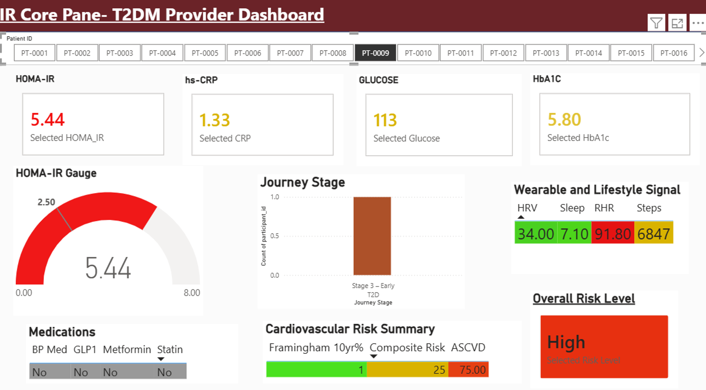
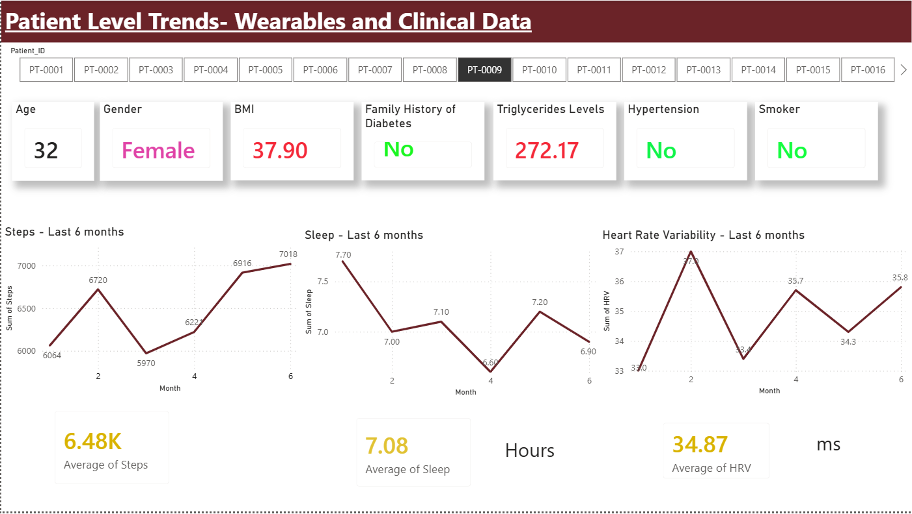

# Personalized Chronic Disease Risk Management & Early Warning Systems

A clinical decision support (CDS) dashboard for early Type 2 Diabetes risk 
identification, integrating EHR data with wearable signals across 2,500 
synthetic patients.

> **Data:** All patient data is synthetic and modeled on the WEAR-ME Study 
> (Nature, 2026). No real patient records are used.

## Background

Early identification of Type 2 Diabetes risk allows preventive intervention 
before disease onset. Traditional screening relies on HbA1c testing alone, 
which can miss insulin-resistant patients. This project builds a composite 
risk score combining six published clinical frameworks with continuous 
wearable signals to identify at-risk patients earlier.

## Dataset

- **2,500 synthetic patients** modeled on the WEAR-ME Study
- **43 clinical variables** including labs, vitals, demographics
- **Wearable signals** — continuous glucose, activity, sleep metrics
- **EHR data** — diagnoses, medications, family history

## Methods

1. **Risk score design** — combined 6 frameworks: FINDRISC, ADA, HOMA-IR, Framingham, ASCVD, WEAR-ME
2. **Tier validation** — three risk strata: High, Intermediate, Low
3. **EDA** — correlation analysis, feature importance ranking across 43 variables
4. **Dashboard development** — clinician-facing in Tableau, patient-facing in Power BI

## Key Findings

### Three cleanly separated risk tiers
Composite score successfully stratified patients:
- High risk: avg score 28.9
- Intermediate risk: avg score 14.5
- Low risk: avg score 7.9

### 15.5% screening gap revealed
HOMA-IR detected **50.5%** of at-risk patients vs. **35%** by HbA1c alone — 
**375 patients missed** by routine screening.

### Top predictors of diabetes risk
- Glucose (r = 0.77)
- BMI (r = 0.70)
- HbA1c (r = 0.63)





## Tools Used

- **Python** — Pandas, SciPy, NumPy
- **Visualization** — Matplotlib, Seaborn
- **Dashboards** — Tableau (clinician-facing), Power BI (patient-facing)
- **Environment** — Jupyter Notebook

## How to Reproduce

```bash
git clone https://github.com/AbhijitaBhat/diabetes-risk-cds-dashboard.git
cd diabetes-risk-cds-dashboard
pip install -r requirements.txt
jupyter notebook notebooks/risk_analysis.ipynb
```

## File Structure

```
diabetes-risk-cds-dashboard/
├── data/                  # Synthetic patient data
├── notebooks/             # EDA and risk score development
├── dashboards/            # Tableau and Power BI files
├── figures/               # Dashboard screenshots and plots
├── requirements.txt
└── README.md
```

## Limitations and Future Work

- Synthetic data may not capture all real-world variability
- External validation on real EHR data needed before clinical use
- Future work: integrate longitudinal trends from wearable data

## Author

**Abhijita Bhat** — MS Bioinformatics, Northeastern University  
📧 bhat.ab@northeastern.edu  
🔗 [LinkedIn](https://www.linkedin.com/in/abhijita-bhat-303027215)
